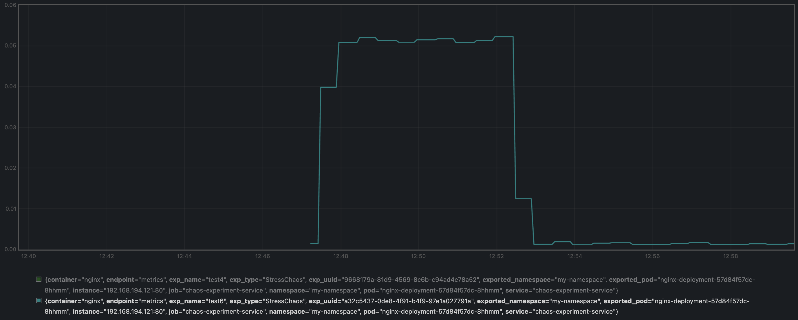

# StressChaos Metrics Export Plan

| Author                               | Update Date | Version |
| ------------------------------------ | ----------- | ------- |
| [@kaaass](https://github.com/kaaass) | 2024/4/10   | 1.1     |

## 1. Overview

This document, authored by [@kaaass](https://github.com/kaaass), outlines the modifications to Chaos Mesh to implement new features. The goal of the new features is to provide users a way to quickly obtain relevant metrics of the Pods affected by a StressChaos experiment.

This document assumes the reader has some knowledge of Kubernetes, Chaos Mesh, and the Prometheus monitoring stack.

## 2. Background

### 2.1 Prometheus

[Prometheus](https://prometheus.io) is an open-source monitoring system used to collect and process real-time time-series data, supporting multidimensional data collection, queries, and alerts.

Metrics in Prometheus are basic units of data storage and processing, consisting of a value and multiple descriptive key-value pairs as labels. Here is an example of a Metric value at a given moment:

```bash
# Metric "cpu_usage" at the current moment for pod-a is 1.234
cpu_usage{key="value", pod="pod-a"} 1.234
# At the current moment for pod-b is 4.567
cpu_usage{key="value", pod="pod-b"} 4.567
```

Prometheus also defines a query language, PromQL, which can match Metric values based on labels and perform some calculations.

### 2.2 Prometheus Operator

[Prometheus Operator](https://github.com/prometheus-operator/prometheus-operator) is an Operator for deploying and managing Prometheus in Kubernetes clusters. It defines several CRDs (Custom Resource Definitions) to facilitate the cluster configuration for Prometheus. Examples include:

- `monitoring.coreos.com/v1.ServiceMonitor` ([documentation](https://prometheus-operator.dev/docs/operator/design/#servicemonitor))
  - Used to define data sources that provide Prometheus Metrics, such as node-exporter.
  - The data source is a Service within the cluster.
- `monitoring.coreos.com/v1.PrometheusRule` ([documentation](https://prometheus-operator.dev/docs/operator/design/#prometheusrule))
  - Used to configure Prometheus rules, usually for:
    - Writing expressions based on existing metrics to define a new metric for user convenience.
      - For example, calculating CPU usage from the collected CPU time Metric `cpu_usage_seconds_total` using the expression `irate(cpu_usage_seconds_total[5m])` to define a new Metric `cpu_usage`.
    - Defining alert rules.

## 3. Plan

### 3.1 Goals

The plan aims to associate Metrics related to StressChaos with specific Chaos Mesh experiments, allowing users to easily observe the effects of an experiment on Grafana or other visualization tools. In other words, identifying a Chaos Mesh experiment will enable querying the associated Pod metrics.

Additionally, if possible, this plan aims to be applicable not only to StressChaos but also to other experiments.

### 3.2 Plan Overview

The core idea is to export a new *associated metric* to maintain the `(experiment, Pod)` relationship. When querying *observated metrics*, the original *observated metrics* that only contained `Pod` information will be joined with the *associated metric*, incorporating experiment-related information into the *observated metrics*. For example, using the *observated metrics* `container_cpu_usage_seconds_total`:

```bash
# Observational Metric
container_cpu_usage_seconds_total{
  container="nginx",
  # Pod information
  namespace="my-namespace", pod="nginx-deployment-57d84f57dc-8hhmm"
} 1.234

# Associated Metric
chaos_experiment{
  # Experiment information
  exp_name="test4", exp_uuid="9668179a-81d9-4569-8c6b-c94ad4e78a52",
  # Pod information
  namespace="my-namespace", pod="nginx-deployment-57d84f57dc-8hhmm"
} 1.0

# After completing the join, the final metric available for user query
chaos:container_cpu_usage_seconds_total{
  container="nginx",
  # Pod information
  namespace="my-namespace", pod="nginx-deployment-57d84f57dc-8hhmm",
  # Experiment information (obtained from the associated Metric through join)
  exp_name="test4", exp_uuid="9668179a-81d9-4569-8c6b-c94ad4e78a52"
} 1.234
```

The main tasks involve:

- Making the `chaos-controller-manager` export the *associated metric*
- Writing Prometheus Operator configuration
  - Importing the *associated metric* (`monitoring.coreos.com/v1.ServiceMonitor`)
  - Calculating the join query of the *associated metric* and *observated metrics*, exporting the *result metric* (`monitoring.coreos.com/v1.PrometheusRule`)
- Packaging the above configurations into Helm Charts for easy one-click user setup.

### 3.3 Expected Outcomes

#### Configuration

The prerequisite is that prometheus-operator or kube-prometheus-stack is already installed:

- Users install the Helm Charts containing the necessary Prometheus configuration.

#### Usage

- Users can query experiment-related metrics in Prometheus. Example queries include:

```bash
# According to the StressChaos experiment name, query the CPU usage of related Pods
chaos:container_cpu_usage_seconds_total{exp_name="experiment name"}

# According to the experiment UUID, query all related Pods and metrics
{exp_uuid="9668179a-81d9-4569-8c6b-c94ad4e78a52"}
```

- Through the above queries, users can create charts in Grafana to observe the metrics related to all Pods affected by a particular StressChaos experiment.

### 3.4 Limitations

- For each type of metric (e.g., CPU Usage), a Pod can only have one observation value:
  - For example, CPU Usage might be calculated for each Container of a Pod, in which case there will be multiple observation values (one for each Container).
  - In such cases, it is necessary to aggregate the observation values at the Pod level. For instance, summing up the CPU Usage of all Containers in a Pod.
- End users are required to install prometheus-operator in their cluster.

## 4. Key Design

### 4.1 Modifications to chaos-controller-manager

It is necessary to add a port to export the *associated metric*, such as using the default port `18080`. The exported metrics are as follows:

```bash
# HELP chaos_experiment Description of chaos_experiment
# TYPE chaos_experiment gauge
chaos_experiment{exp_name="test4",exp_type="StressChaos",exp_uuid="9668179a-81d9-4569-8c6b-c94ad4e78a52",namespace="my-namespace",pod="nginx-deployment-57d84f57dc-8hhmm"} 1.0
chaos_experiment{exp_name="test4",exp_type="StressChaos",exp_uuid="9668179a-81d9-4569-8c6b-c94ad4e78a52",namespace="my-namespace",pod="nginx-deployment-c67334f16d-b9zqm"} 1.0
```

The `chaos_experiment` metric indicates the relationship between a Chaos experiment and the related Pod, described by labels:

| Label       | Meaning                                          |
| ----------- | ------------------------------------------------ |
| `exp_name`  | Experiment name                                  |
| `exp_type`  | Type of experiment, currently only `StressChaos` |
| `exp_uuid`  | UUID of the experiment                           |
| `namespace` | Namespace where the involved Pod is located      |
| `pod`       | Name of the involved Pod                         |

The value of the `chaos_experiment` metric is meaningless, always set to `1.0`.

For all conducted experiments, we iterate through all involved Pods and then export a `chaos_experiment` metric for each.

### 4.2 Associated Queries

The goal of associated queries is to use the labels `(namespace, pod)` to join the *associated metric* with the *observated metrics*, ultimately making the *observated metrics* carry the `exp_*` labels related to the Chaos Mesh experiment.

The principle of associated queries is PromQL’s `group_left` operator and vector matching. For instance, the CPU usage time  *observated metrics* `container_cpu_usage_seconds_total` would be proccessed by the following query:

```bash
# Make sure there isn't two metrics have same (namespace, pod) label
sum(container_cpu_usage_seconds_total) by (namespace, pod)
	# Multiply by the value of chaos_experiment, which has no effect because the value is always 1.0, but is used to trigger the associated query
	*
	# Match based on the namespace, pod labels
	on(namespace, pod)
	# Add the exp_* labels from chaos_experiment into the results
	group_right
chaos_experiment
```

### 4.3 Prometheus Operator Configuration

##### Configuration of `ServiceMonitor`

Primarily, import the `18080` port mentioned in section 4.1 as a data source into Prometheus.

```yaml
# Metric exporting service
apiVersion: v1
kind: Service
metadata:
  name: chaos-experiment-service
  labels:
    app: chaos-experiment-exporter
spec:
  ports:
  # Corresponding to the 18080 port of chaos-controller-manager
  - name: experiment-metrics
    port: 18080
  selector:
    app: chaos-controller-manager
---
# Import the above service into Prometheus configuration
apiVersion: monitoring.coreos.com/v1
kind: ServiceMonitor
metadata:
  name: chaos-experiment-monitor
  labels:
    release: prometheus # To enable this monitor, corresponding to Prometheus's serviceMonitorSelector
spec:
  endpoints:
  - port: metrics
    interval: 30s
    scheme: http
  selector:
    matchLabels:
      app: chaos-experiment-exporter # Match the earlier service
```

##### Configuration of `PrometheusRule`

Primarily, the query mentioned in section 4.2 is configured into Prometheus. Note that every metric related to the experiment (CPU usage, memory usage, etc.) needs to add a record.

```yaml
# Create Prometheus rule for the result metric
apiVersion: monitoring.coreos.com/v1
kind: PrometheusRule
metadata:
  name: chaos-experiment-rule
  labels:
    release: prometheus # Similar to the previous section
spec:
  groups:
  - name: chaos.rules.container_cpu_usage_seconds_total
    rules:
    - # Create a metric named "chaos:container_cpu_usage_seconds_total"
      record: chaos:container_cpu_usage_seconds_total
      # Expression similar to section 4.2
      # Here, use label_replace mainly because when importing metrics, the pod label is automatically renamed to exported_pod, so here it is renamed back to pod
      expr: |
        sum(container_cpu_usage_seconds_total) by (namespace, pod) * on(namespace, pod) group_right label_replace(
          label_replace(
            chaos_experiment,
            "pod", "$1", "exported_pod", "(.*)"
          ),
          "namespace", "$1", "exported_namespace", "(.*)"
        )
```

## 5. Proof of Concept

### 5.1 Implementation

Currently, a Python script is used to generate Metrics from a CSV file temporarily:

```csv
exp_uuid,exp_name,exp_type,namespace,pod,value
a32c5437-0de8-4f91-b4f9-97e1a027791a,test6,StressChaos,my-namespace,nginx-deployment-57d84f57dc-8hhmm,1
```

This script is used to implement the changes described in Section 4.1. Other Prometheus configurations are referred to in Section 4.

### 5.2 Experimental Setup

The experiment set up a `Deployment nginx-deployment` in `my-namespace`. During the experiment, Nginx was requested every 0.2 seconds to simulate normal load.

Afterward, a StressChaos experiment with `cpu.load = 5` lasting 5 minutes was initiated, and Metrics were exported manually using the configured CSV.

### 5.3 Screenshots


