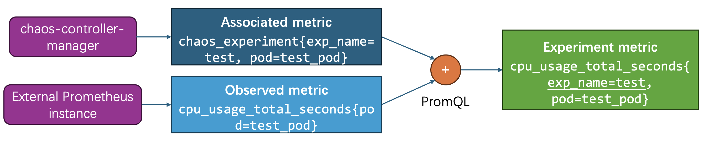
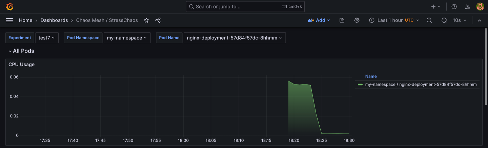

# chaos-experiment-exporter

Proof-of-Concept prometheus exporter and related rules to bring pod-level experiment metrics to Chaos Mesh.

> NOTICE: This is a proof-of-concept project and is not intended for production use.

The main goal of the repository is to provide a way to expose the pod-level metrics to the external observability stack (e.g., prometheus). The basic idea is to introduce an *associated metric* to export the relation between chaos experiments and the affected pods, and then join the experiment-related labels to the *observed metrics* using PromQL. The implementation detail can be found at [PLAN.md](PLAN.md).



This repository provides a PoC implementation for the plan, includes:

- An exporter to implement the designed modifications of chaos-controller-manager.
- A helm chart includes the exporter deployments and promeheus-operator configuration.
- An example Grafana dashboard for visualization.

## Usage

1. Install `chaos-mesh` and `prometheus-operator` (or `kube-prometheus-stack`).
2. Install `chaos-experiment-exporter`.
   * It recommend to install the charts to the same namespace of `chaos-mesh` charts.

```bash
helm install chaos-experiment-exporter ./charts -n=chaos-mesh
```

## Screenshot



## Exported metrics

| Chaos       | Metric                                                       | Description                                                  |
| ----------- | ------------------------------------------------------------ | ------------------------------------------------------------ |
| StressChaos | `chaosmesh:stresschaos:pod_cpu_usage_seconds_total:sum_irate` | Provides the sum of the rate of CPU usage in seconds for each pod affected by a StressChaos experiment, offering a real-time view of CPU stress effects. |
| StressChaos | `chaosmesh:stresschaos:pod_memory_working_set_bytes`         | Measures the total working set of memory in bytes for pods affected by a StressChaos experiment, indicating the current memory actively used by the pod. |
| StressChaos | `chaosmesh:stresschaos:pod_memory_rss`                       | Records the Resident Set Size, the portion of memory occupied by a process that is held in RAM, for pods affected by a StressChaos experiment. |
| StressChaos | `chaosmesh:stresschaos:pod_memory_cache`                     | Tracks the amount of memory in bytes used for cache by the pods affected by a StressChaos experiment. |
| StressChaos | `chaosmesh:stresschaos:pod_memory_swap`                      | Reports the swap memory usage for pods affected by a StressChaos experiment. |

## Support more experiment types

Currently, only metrics related to StressChaos are supported. However, it is quite simple to support more experiment types. For more experiment types, only prometheus rules ([prometheus-rules.yaml](charts/templates/prometheus-rules.yaml)) needs to be extended.
